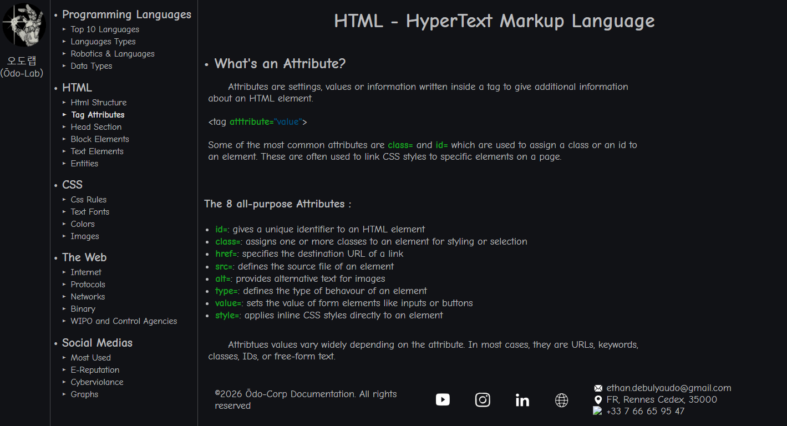

# Odolab Documentation
This is a personal HTML/CSS website project. 
It includes multiple pages, navigation, and responsive design. 
The goal of this project is to practice front-end development in a
wikipedia-looking website.

### Live Demo
https://OdoLab.github.io/documentation/

## Screenshot

## Technologies Used

- HTML5
- CSS3

## How to Run

1. Download or clone the repository
2. Open index.html in your browser

## Version : v0.8.1

## Changelog

### v0.8 

- Added new content to the navigation bar
- New : CSS Colors!
- New : CSS Images!

#### v0.8.1 Changelog

- Fixed the file hierarchy
- Fixed flexbox layout bug

